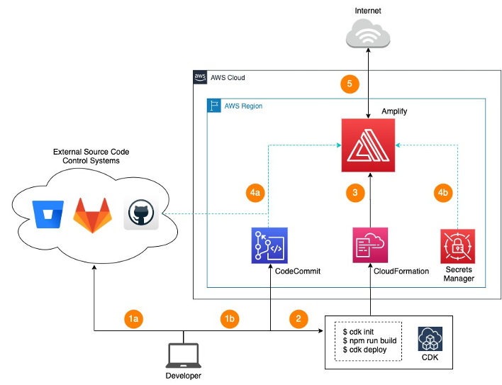

# Deploying a Static Website with AWS Amplify and CDK


Sample React application that will be hosted on AWS Amplify (created with _npx create-react-app_). we will be using AWS Cloud Development Kit (AWS CDK) to develop the infrastructure and the configurations required to host the application on Amplify.



Deploying infrastructure with AWS CDK will enable DevOps teams to:

* standardize infrastructure components
* deploy in a repeatable manner
* develop with familiar programming language

Managed Service Providers that offer website hosting services will also benefit from an automated deployment and management of multiple Amplify applications across various customers.

**Important**: in CDK v2, amplify is in alpha stages An experimental construct library for this service is available in preview. Since it is not stable yet, it is distributed as a separate package so that you can pin its version independently of the rest of the CDK. So we are using: _@aws-cdk/aws-amplify-alpha_

## Deployment

```sh
cd ~/amplify-sample-app/amplify-infra
npm run build
cdk deploy
```

Commit the “amplify-sample-app” folder (which contains the sample React app and the cdk code) to the repository using standard git commands.

## Useful commands

* `npm run build`   compile typescript to js
* `npm run watch`   watch for changes and compile
* `npm run test`    perform the jest unit tests

## Useful CDK commands (inside amplify-infra folder)

* `cdk deploy`      deploy this stack to your default AWS account/region
* `cdk diff`        compare deployed stack with current state
* `cdk synth`       emits the synthesized CloudFormation template
* `cdk destroy`     destroy all created aws resources

## AWS CDK Installation

The AWS CDK Toolkit, the CLI command cdk, is the primary tool for interacting with your AWS CDK app. It will be used to deploy the CDK code to the target AWS environment. To install, use the command below.

```sh
npm install -g aws-cdk
```

## Building the infrastructure with AWS CDK (already created in this repo)

The below command creates the CDK app which will be developed in Typescript. The CDK app will be stored in the new folder amplify-infra. The typescript code for the cdk app will be defined in the file amplify-infra-stack.ts which is in the lib folder of the CDK application (amplify-react-sample/amplify-infra/lib/amplify-infra-stack.ts).

```sh
cd ~/amplify-sample-app
mkdir amplify-infra
cd amplify-infra
cdk init --language typescript
```

## To build the application and deploy the resources to AWS cloud, run the following commands

```sh
cd ~/amplify-sample-app/amplify-infra
npm run build
cdk deploy
```

### Using Github

Amplify application can also be created from a code base in GitHub repository. CDK provides a class [GitHubSourceCodeProvider](https://docs.aws.amazon.com/cdk/api/latest/docs/@aws-cdk_aws-amplify.GitHubSourceCodeProvider.html) within the **@aws-cdk/aws-amplify package** which enables an amplify application to be created by specifying the repository owner, name and a [personal access token](https://docs.github.com/en/github/authenticating-to-github/creating-a-personal-access-token). The token will need to be granted the “repo” scope to give amplify the necessary permission to access the repository. For example, amplify will create a webhook in the GitHub repository which will be triggered when one or more commits are pushed to a repository branch or tag. In the code example below, the token generated is stored encrypted as a key-value pair in AWS Secrets Manager and will be retrieved at runtime to access the GitHub repository.

To get a Github token, go to your Github account develop settings and generate a personal access token. Amplify will need quite high access rights to your repository as it will need to generate ssh keys to clone the repository.

To store the token in AWS, we recommend to use the AWS [Secret Manager service](https://aws.amazon.com/secrets-manager). Be careful to choose a plain text secret (in the AWS console select "Store a new secret", "Other type of secret" and finally "Plaintext"). Choose a key name that matches the key used in the GitHubSourceCodeProvider construct (GITHUB_TOKEN_KEY in this example).

```typescript
// ~/amplify-react-sample/amplify-infra/lib/amplify-infra-stack.ts

import { RemovalPolicy, Stack, StackProps, CfnOutput, SecretValue } from "aws-cdk-lib";
import { App, CodeCommitSourceCodeProvider } from "@aws-cdk/aws-amplify-alpha";
import { Construct } from "constructs";
import { GitHubSourceCodeProvider } from "@aws-cdk/aws-amplify-alpha/lib/source-code-providers";

export class AmplifyInfraStack extends Stack {
  constructor(scope: Construct, id: string, props?: StackProps) {
    super(scope, id, props);

    // Part 2 - Creation of the Amplify Application
    const amplifyApp = new App(this, "sample-react-app ", {
      sourceCodeProvider: new GitHubSourceCodeProvider({
        owner: "[Repository-Owner]",
        repository: "[Repository-Name]",
        oauthToken: SecretValue.secretsManager('GITHUB_TOKEN_KEY'),
      }),
    });
    const masterBranch = amplifyApp.addBranch("master");
  }
}
```

### Using AWS CodeCommit

```typescript
// import { App, CodeCommitSourceCodeProvider, AutoBranchCreation } from "@aws-cdk/aws-amplify-alpha";

const repository = new codecommit.Repository(
  this,
  "AmplifyReactTestRepo",
  {
    repositoryName: "amplify-react-test-repo",
    description:
      "CodeCommit repository that will be used as the source repository for the sample react app and the cdk app",
  }
);

const sourceCodeProvider = new CodeCommitSourceCodeProvider({
  repository: repository,
});

repository.applyRemovalPolicy(RemovalPolicy.DESTROY); //Destroy this resource if 'cdk destroy' is invoked. Default is RETAIN
```

## License

This project is licensed under the MIT License - see the [LICENSE.md](LICENSE.md) file for more information.

## Credits

Based on this beautifull [article](https://dev.to/kumo/deploying-nextjs-13-with-amplify-cdk-1dgd)
